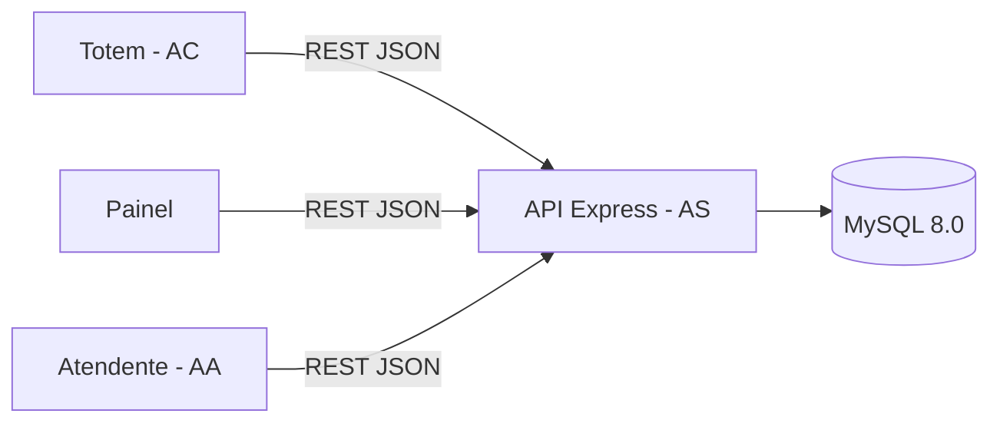

# nassauTickets

Sistema de Controle de Atendimento (emissão, fila, chamada e atendimento de senhas) para um **Laboratório de Análises Clínicas**. Projeto acadêmico da UNINASSAU.

## Descrição

O nassauTickets organiza o atendimento presencial de um laboratório por meio de senhas. O cliente retira a senha anonimamente em um **totem**, acompanha as chamadas em um **painel** (com aviso sonoro) e é atendido em um **guichê** por um **atendente**, que usa o sistema para chamar, iniciar e encerrar cada atendimento. O gestor consulta relatórios diários e mensais, incluindo auditoria.

O sistema trabalha com três agentes:

| Sigla | Agente | Papel |
|-------|--------|-------|
| AS | Agente Sistema | Executa as regras, acessa o banco, emite senhas e atualiza o painel |
| AA | Agente Atendente | Chama o próximo da fila e realiza o atendimento no guichê |
| AC | Agente Cliente | Emite a senha no totem e aguarda a chamada no painel |

E com três tipos de senha: **SP** (Prioritária), **SG** (Geral) e **SE** (Retirada de Exames).

## Objetivo

Construir, em grupo, um sistema Web completo que atenda aos requisitos do laboratório e demonstre boas práticas de organização, documentação, versionamento (Git/GitHub) e desenvolvimento com React e Node.js.

## Tecnologias utilizadas

| Camada | Tecnologia |
|--------|-----------|
| Frontend | React 19 + Vite, React Router |
| Backend | Node.js LTS 22 + Express |
| Banco de dados | MySQL 8.0 |
| Versionamento | Git e GitHub (branches `main` e `dev`) |

**Justificativa do backend:** Node.js com Express usa a mesma linguagem (JavaScript) do frontend, o que reduz a curva de aprendizado do grupo e facilita a troca de funções entre os integrantes. O Express é leve, tem ampla documentação e o driver `mysql2` oferece transações e *prepared statements*, necessários para a concorrência na chamada de senhas. A stack está entre as já suportadas pela infraestrutura do laboratório.

## Arquitetura



- **Frontend (React):** três telas principais — `/totem`, `/painel` e `/atendente`.
- **Backend (Express):** camadas `routes → controllers → services → banco`. As regras de negócio (fila, numeração, expediente) ficam em `services/` e `utils/`, isoladas e testáveis.
- **Banco (MySQL):** o backend é a única fonte da verdade. A chamada do próximo atendimento é feita em transação com travamento de linha, para impedir que dois atendentes recebam a mesma senha.

## Estrutura do repositório

```
nassauTickets/
├── backend/        # API Node.js + Express
├── docs/
│   ├── branding/   # identidade visual
│   ├── mer/        # modelo entidade-relacionamento
│   ├── mockups/    # protótipos das telas
│   ├── models/
│   │   └── uml/    # diagramas UML
│   └── requirements/  # requisitos funcionais, não funcionais e regras de negócio
├── frontend/       # aplicação React
├── .gitignore
├── LICENSE
└── README.md
```

## Pré-requisitos

- Node.js 22 LTS e npm
- MySQL 8.0
- Git

## Instalação

```bash
# 1. Clonar e entrar na branch de desenvolvimento
git clone https://github.com/<usuario-ou-organizacao>/nassauTickets.git
cd nassauTickets
git switch dev

# 2. Criar o banco e as tabelas
mysql -u root -p < backend/database/schema.sql
```

Crie um usuário de banco com privilégios mínimos para a aplicação:

```sql
CREATE USER 'nassau'@'localhost' IDENTIFIED BY 'troque_esta_senha';
GRANT SELECT, INSERT, UPDATE, DELETE ON nassautickets.* TO 'nassau'@'localhost';
```

```bash
# 3. Backend
cd backend
cp .env.example .env     # ajuste as credenciais do banco
npm install

# 4. Frontend (em outro terminal)
cd frontend
npm install
```

## Execução

```bash
# Backend  ->  http://localhost:3000/api/health
cd backend
npm run dev

# Frontend ->  http://localhost:5173
cd frontend
npm run dev
```

Em desenvolvimento, o Vite encaminha as chamadas `/api` para `http://localhost:3000`.

Testes automatizados das regras de negócio:

```bash
cd backend
npm test
```

## Configuração

Variáveis do backend (`backend/.env`, modelo em `backend/.env.example`):

| Variável | Descrição | Padrão |
|----------|-----------|--------|
| `PORT` | Porta da API | `3000` |
| `TZ` | Fuso horário do expediente | `America/Recife` |
| `CORS_ORIGIN` | Origens permitidas, separadas por vírgula | `http://localhost:5173` |
| `DB_HOST` / `DB_PORT` | Servidor MySQL | `localhost` / `3306` |
| `DB_USER` / `DB_PASSWORD` | Credenciais do banco | — |
| `DB_NAME` | Nome do banco | `nassautickets` |

O arquivo `.env` **não** é versionado. Variável do frontend (opcional): `VITE_API_URL` (padrão `/api`).

## API (estado atual)

| Método | Rota | Descrição |
|--------|------|-----------|
| GET | `/api/health` | Verifica a API e o banco (503 se o banco estiver fora) |
| POST | `/api/senhas` | Emite uma senha. Corpo: `{ "tipo": "SP" \| "SG" \| "SE" }` |
| GET | `/api/painel` | Retorna as 5 últimas senhas chamadas |

## Documentação

- [Requisitos funcionais](docs/requirements/requisitos-funcionais.md)
- [Requisitos não funcionais](docs/requirements/requisitos-nao-funcionais.md)
- [Regras de negócio](docs/requirements/regras-de-negocio.md)

## Membros

| Nome | Matrícula | Papel |
|------|-----------|-------|
| Nícolas Tenório | 01888929 | Scrum Master / Desenvolvedor |
| Thiago Romero | 01839709 | Desenvolvedor / Testador |
| Emanuel Longmman | 01839546 | Documentador / Desenvolvedor |

## Branches e fluxo de versionamento

| Branch | Finalidade |
|--------|-----------|
| `main` | Versão estável e entregável. Recebe código apenas por *merge* da `dev` |
| `dev` | Desenvolvimento. Todo commit é enviado primeiro para ela |

Fluxo:

1. Atualize a `dev`: `git switch dev && git pull`.
2. Trabalhe em commits pequenos e objetivos, no padrão [Conventional Commits](https://www.conventionalcommits.org/pt-br/): `feat:`, `fix:`, `docs:`, `chore:`, `test:`.
3. Envie para a `dev`: `git push origin dev`.
4. Quando uma etapa estiver pronta e testada, integre à `main` com um *merge* que preserve o histórico:

```bash
git switch main
git pull
git merge --no-ff dev
git push origin main
```

Cada integrante deve commitar com a própria conta do GitHub.

## Licença

Distribuído sob a licença MIT. Veja o arquivo [LICENSE](LICENSE).
