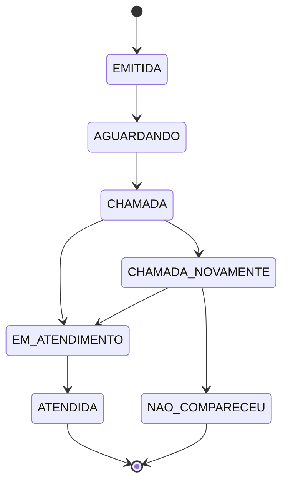

# Regras de Negócio — nassauTickets

## RN01 — Tipos de senha

| Tipo | Nome | Característica |
|------|------|----------------|
| SP | Senha Prioritária | Maior prioridade de atendimento |
| SE | Senha para retirada de Exames | "Prioridade operacional especial": atendimento muito rápido, chamada logo após uma SP |
| SG | Senha Geral | Menor prioridade |

## RN02 — Numeração

Formato: `YYMMDD-PPSQ` (12 caracteres).

| Parte | Significado |
|-------|-------------|
| `YY` | Ano da emissão, 2 dígitos |
| `MM` | Mês da emissão, 2 dígitos |
| `DD` | Dia da emissão, 2 dígitos |
| `PP` | Tipo da senha: `SP`, `SG` ou `SE` |
| `SQ` | Sequencial por tipo, 3 dígitos, reiniciado todo dia |

Exemplos: `261004-SP001`, `261004-SG012`, `261004-SE003`.

## RN03 — Sequencial

- Cada tipo tem seu próprio contador, de 001 a 999, reiniciado diariamente.
- Se um tipo chegar a 999 no dia, novas emissões desse tipo são recusadas com mensagem ao cliente (ver Pendências).

## RN04 — Ordem de prioridade

SP → SE → SG. SP tem a maior prioridade, SE é chamada logo após uma SP e SG tem a menor.

## RN05 — Intercalação da fila

A cada novo atendimento, a senha chamada deve ser de **tipo diferente** da anterior, seguindo o ciclo:

```
SP → SE → SG → SP → SE → SG ...
(diagrama da especificação: [SP] → [SE|SG] → [SP] → [SE|SG])
```

- Não importa quantas senhas SG existam: a cada ciclo, uma SP é atendida primeiro (se houver), depois uma SE (se houver) e só então uma SG.
- Dentro de cada tipo, a ordem é de emissão (menor sequencial primeiro).
- O sistema guarda o **último tipo chamado** para saber onde o ciclo parou.

## RN06 — Fila vazia

Se a fila do próximo tipo do ciclo estiver vazia, o sistema pula para o tipo seguinte do ciclo. Se só existir um tipo com senhas, ele é chamado mesmo que seja igual ao anterior. Se todas as filas estiverem vazias, a resposta é "fila vazia".

## RN07 — Guichês

- Qualquer guichê atende qualquer tipo de senha (não há guichê específico).
- Cada guichê tem no máximo uma senha ativa (`CHAMADA`, `CHAMADA_NOVAMENTE` ou `EM_ATENDIMENTO`) por vez. Só depois de finalizar ou registrar o não comparecimento ele pode chamar outra.

## RN08 — Não comparecimento

- Cada senha pode ser chamada no máximo **duas vezes**.
- Se o cliente não comparecer após a segunda chamada, a senha vai para `NAO_COMPARECEU` (considerada abandonada pelo cliente) e o sistema segue para a próxima prioridade.
- Senhas `NAO_COMPARECEU` não passam por atendimento (SA).

## RN09 — Taxa de não atendimento (5%)

Pelo histórico, cerca de 5% das senhas emitidas não são atendidas por motivos do cliente. Esse valor é **referência**, não cota: o sistema não descarta senhas para atingi-lo. Ele serve para (a) o indicador de desempenho do gestor e (b) a probabilidade de ausência no modo de simulação.

## RN10 — Tempo médio de atendimento (TM)

Valores de referência da especificação, usados no modo de simulação e como meta de comparação:

| Tipo | TM de referência | Variação |
|------|------------------|----------|
| SP | 15 min | ± 5 min, distribuição uniforme (10 a 20 min) |
| SG | 5 min | ± 3 min, distribuição uniforme (2 a 8 min) |
| SE | 1 min em 95% dos atendimentos | 5 min nos outros 5% (média geralmente abaixo de 2 min) |

O TM exibido nos relatórios é sempre o **medido**: média de (fim − início do atendimento) das senhas `ATENDIDA`, por tipo.

## RN11 — Expediente

- O expediente vai das **7h às 17h** (fuso configurável).
- Fora dele, o sistema não emite senhas nem permite novas chamadas.

## RN12 — Atendimentos em andamento no fim do expediente

Atendimentos iniciados antes das 17h devem ser concluídos pelo atendente, com a função de encerrar o atendimento.

## RN13 — Senhas remanescentes

As senhas que continuarem na fila às 17h são **descartadas**: não são atendidas e continuam contadas como emitidas. O descarte é registrado com data/hora e motivo `FIM_EXPEDIENTE`, sem criar um oitavo estado.

## RN14 — Painel de chamadas

- Mostra as **5 últimas senhas chamadas**.
- Nunca mostra a próxima senha, pois uma nova emissão pode mudar a sequência entre o fim de um atendimento e a próxima chamada.

## RN15 — Chamar novamente e áudio

- A cada chamada, o áudio informa a prioridade, o sequencial e o guichê. Exemplo: "Senha prioritária, zero zero um. Guichê três."
- "Chamar Novamente" repete a chamada com o áudio precedido por "Última chamada" e conta como a segunda chamada (RN08).

## RN16 — Máquina de estados



| De | Para | Gatilho | Ator |
|----|------|---------|------|
| (início) | EMITIDA | Cliente retira a senha no totem | AC / AS |
| EMITIDA | AGUARDANDO | Senha entra na fila | AS (automático) |
| AGUARDANDO | CHAMADA | Chamar próximo | AA |
| CHAMADA | CHAMADA_NOVAMENTE | Chamar novamente | AA |
| CHAMADA ou CHAMADA_NOVAMENTE | EM_ATENDIMENTO | Iniciar atendimento | AA |
| CHAMADA_NOVAMENTE | NAO_COMPARECEU | Cliente não compareceu após 2 chamadas | AA / AS |
| EM_ATENDIMENTO | ATENDIDA | Finalizar atendimento | AA |

- `ATENDIDA` e `NAO_COMPARECEU` são estados finais.
- Nos identificadores de código e no banco, o estado é escrito sem acento: `NAO_COMPARECEU`.

## RN17 — Perfis de acesso

- **AC (cliente):** anônimo, só interage com o totem.
- **AA (atendente):** faz login e opera o guichê.
- **Gestor:** um único atendente tem também o perfil de gestor, responsável por cadastros e relatórios.

## RN18 — Relatórios

- Periodicidade: diário e mensal (mês civil).
- Senha **emitida** = qualquer senha gerada no período. Senha **atendida** = senha no estado `ATENDIDA`.
- O relatório detalhado deixa em branco data/hora do atendimento e guichê das senhas não atendidas.

## RN19 — Auditoria

Para cada senha, o relatório de auditoria registra: atendente, guichê, senha, horário da 1ª chamada, horário da 2ª chamada (se houver), início e fim do atendimento. Os registros não podem ser alterados nem apagados pela aplicação.

## RN20 — Concorrência na chamada

Se dois ou mais atendentes pedirem o próximo ao mesmo tempo, as requisições são processadas **em série**: o primeiro a ser processado recebe a senha pela RN05 e o seguinte recebe a senha seguinte. Nunca há duas chamadas para a mesma senha.

## Pendências para confirmar com o professor

| # | Ponto | Decisão provisória do grupo |
|---|-------|-----------------------------|
| 1 | O diagrama `[SP] → [SE\|SG] → [SP]` e o texto ("SP, depois SE, por fim SG") podem ser lidos de formas diferentes | Ciclo SP → SE → SG, pulando filas vazias (RN05) |
| 2 | O sequencial tem só 3 dígitos | Limite de 999 por tipo e dia; recusar novas emissões (RN03) |
| 3 | A especificação só cita o expediente para chamadas | Bloquear também a emissão fora do horário (RN11) |
| 4 | Senhas descartadas no fim do dia não têm estado próprio na máquina de estados | Registrar `descartada_em` e motivo, sem novo estado (RN13) |
| 5 | Fuso horário do laboratório não é informado | `America/Recife`, configurável |
